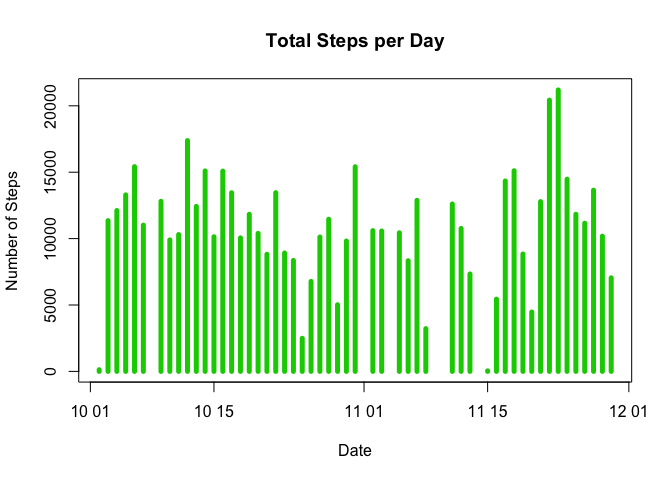
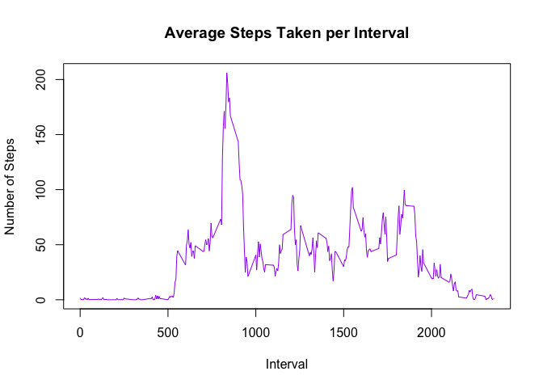
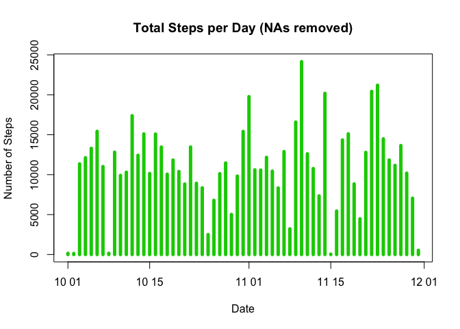
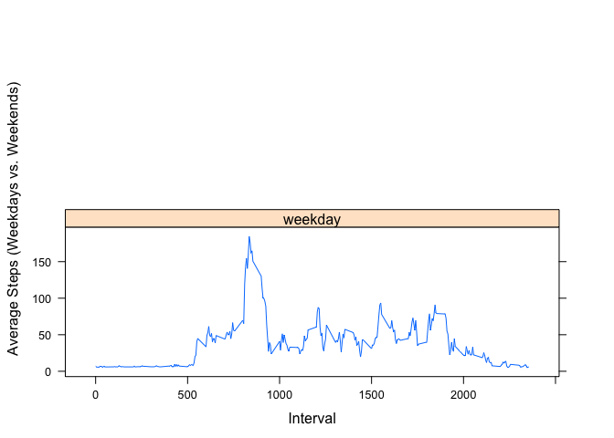

# Reproducible Research: Peer Assessment 1
Jamin Chai  
7th June, 2017  

## loading and preprocessing the data
Change the working directory and load data into data frame `data`.

```r
act <- read.csv("activity.csv")
act$date <- as.Date(act$date, "%Y-%m-%d")
```

## What is mean total number of steps taken per day?
* Aggregate data frame containing steps and date.
* create a histogram.
* Calculate mean and median number of steps.

```r
steps_day <- aggregate(steps ~ date, act, sum)
plot(steps ~ date, data=steps_day, type="h", xlab="Date", ylab="Number of Steps", main="Total Steps per Day", lwd=5, col=3)
```

<!-- -->

```r
steps_mean <- mean(steps_day$steps)
steps_median <- median(steps_day$steps)
```

## What is the average daily activity pattern?
* Calculate average steps for each interval for all days.
* Plot the average number of steps per Day by interval.
* Find intervals with most average steps.

```r
steps_interval <- aggregate(steps ~ interval, act, mean)
plot(steps ~ interval, data = steps_interval, type="l", xlab="Interval", ylab="Number of Steps", main="Average Steps Taken per Interval", lwd=1, col="purple")
```

<!-- -->

```r
interval_max <- steps_interval[which.max(steps_interval$steps), 1]
```

## Impute missing values.
* Calculate the total number of missing values of the data and replace them with the mean value for 5-minute interval.

```r
data_NAs <- sum(is.na(act$steps))
Ind_NAs <- which(is.na(act$steps))
data_means <- means_merged <- merge(act, steps_interval, by="interval", suffixes = c(".actual", ".average"))
act[Ind_NAs, "steps"] <- data_means[Ind_NAs, "steps.average"]
```

* Create a histogram of the total number of steps taken per day.

```r
new_act <- aggregate(steps ~ date, act, sum)
plot(steps ~ date, data = new_act, type="h", xlab="Date", ylab="Number of Steps", main="Total Steps per Day (NAs removed)", lwd=5, col=3)
```

<!-- -->

* Calculate the new mean and median number of steps per day.

```r
new_steps_mean <- mean(new_act$steps)
new_steps_median <- median(new_act$steps)
```

## Are there differences in activity patterns between weekdays and weekends?
* Create a factor variable containing “weekday” and “weekend” levels which indicates whether a date is a weekday or weekend day.

```r
act$type <- ifelse(weekdays(act$date) %in% c("Saturday", "Sunday"),"weekend", "weekday")
act$type <- as.factor(act$type)
act_type <- setNames(aggregate(act$steps, by = list(act$type, act$interval), FUN = mean, na.rm=TRUE), c("type","interval","average_steps"))
```

* Create a panel plot containing a time series plot of the 5-minute interval and the average number of steps taken, averaged across all weekday days or weekend days.

```r
library(lattice)
xyplot(average_steps ~ interval | type, type= "l", data = act_type, layout = c(1,2), xlab = "Interval", ylab = "Average Steps (Weekdays vs. Weekends)")
```

<!-- -->
